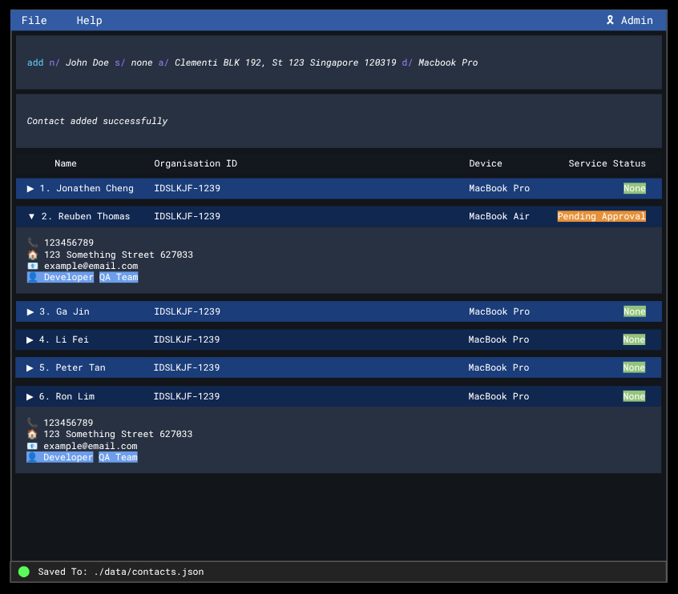

# DeskFlow

## Overview

DeskFlow is an enterprise focused contacts and asset management platform for IT helpdesks anywhere. Focusing on safety, security, reliability and an intuitive command-line first UI, DeskFlow will help bring flow to your IT helpdesk. Most importantly, we allow you to manage important information on devices that your organization members use, all in one place!

## Getting Started

For detailed documentation of the project, see the **[DeskFlow Product Website](https://ay2425s2-cs2103t-t10-2.github.io/tp/)**.

## CS2103T Project Information

- The project simulates an ongoing software project for a desktop application (called _AddressBook_) used for managing contact details.
  - It is **written in OOP fashion**. It provides a **reasonably well-written** code base **bigger** (around 6 KLoC) than what students usually write in beginner-level SE modules, without being overwhelmingly big.
  - It comes with a **reasonable level of user and developer documentation**.
- This project is a **part of the se-education.org** initiative. If you would like to contribute code to this project, see [se-education.org](https://se-education.org/#contributing-to-se-edu) for more info.

## References

This project is based on the AddressBook-Level3 project created by the [SE-EDU initiative](https://se-education.org).

