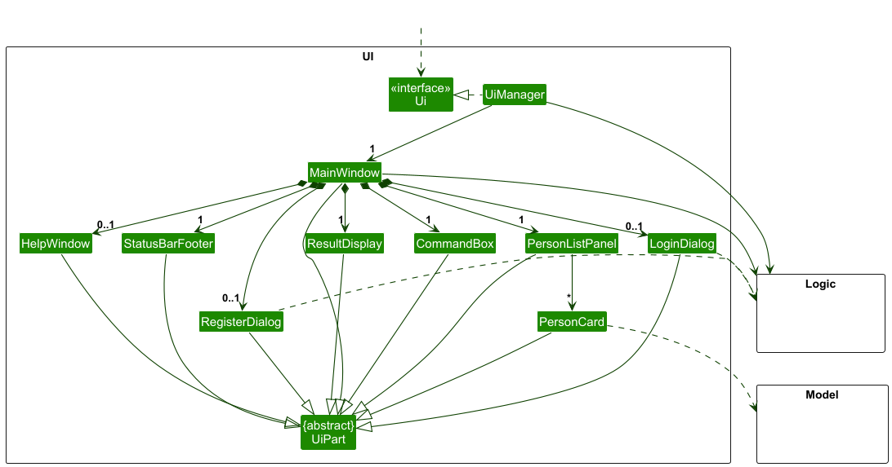
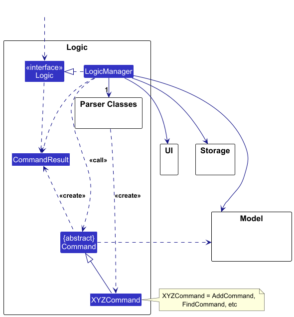
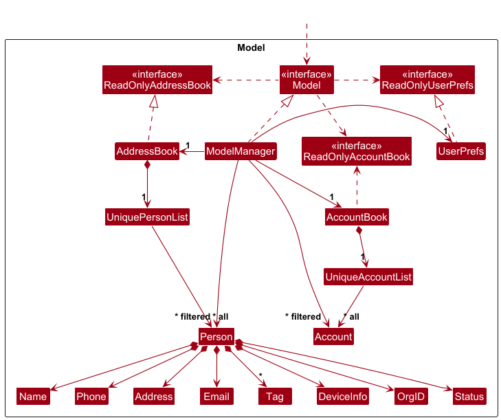
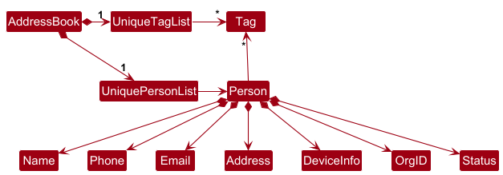
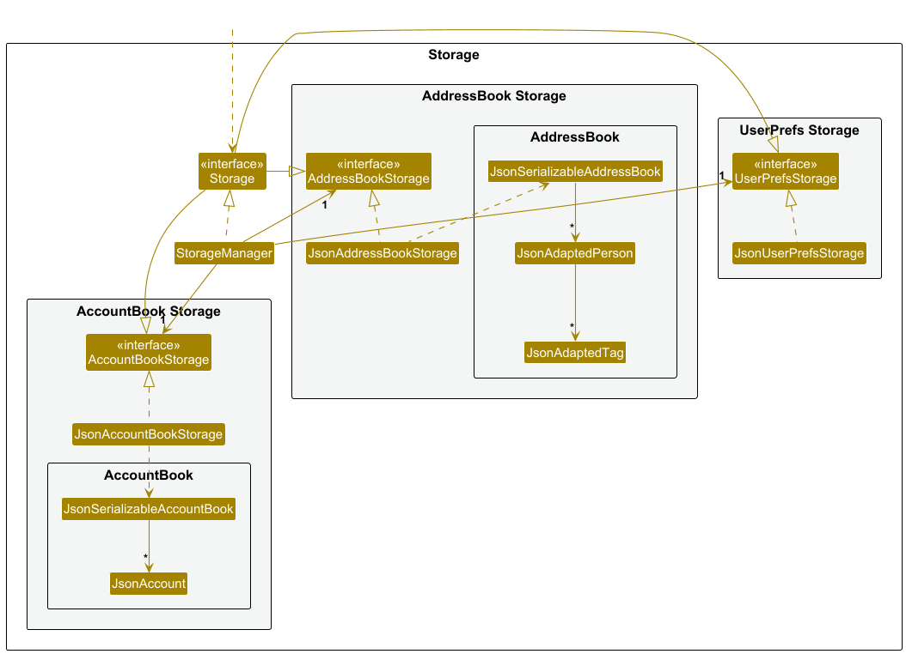
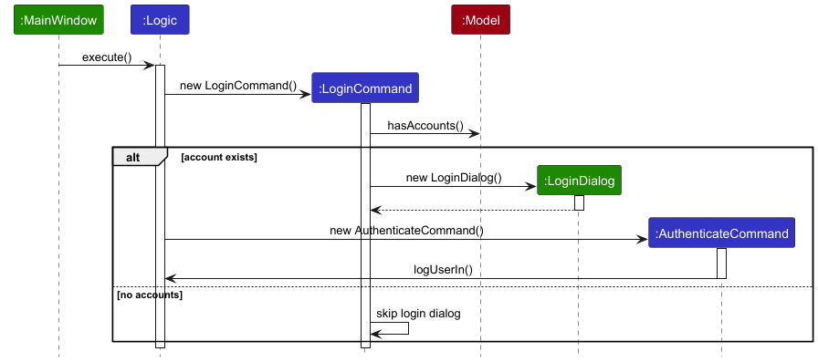
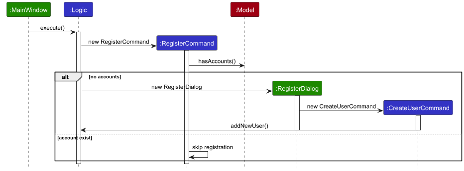
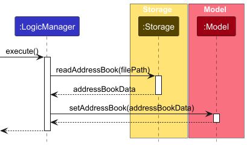

## Table of Contents

- [Acknowledgements](#acknowledgements)
    - [External Libraries](#external-libraries)
    - [AI / Code Completion Tools](#ai--code-completion-tools)
    - [Creating Resizable Graphics Section in TitledPane](#creating-resizable-graphics-section-in-titledpane)
    - [Reference Material](#reference-material)
- [Design](#design)
    - [Architecture](#architecture)
    - [UI component](#ui-component)
    - [Logic component](#logic-component)
    - [Model component](#model-component)
    - [Storage component](#storage-component)
    - [Common classes](#common-classes)
- [Implementation](#implementation)
    - [Login Feature](#login-feature)
    - [Register Feature](#Register-feature)
    - [Import feature](#import-feature)
- [Appendix: Requirements](#appendix-requirements)
    - [Product scope](#product-scope)
    - [User stories](#user-stories)
    - [Use cases](#use-cases)
    - [Non-Functional Requirements](#non-functional-requirements)
    - [Glossary](#glossary)
- [Appendix: Planned Enhancements](#appendix-planned-enhancements)
- [Appendix: Instructions for manual testing](#appendix-instructions-for-manual-testing)
    - [Launch and shutdown](#launch-and-shutdown)
    - [Deleting a person](#deleting-a-person)
    - [Saving data](#saving-data)

--------------------------------------------------------------------------------------------------------------------

## **Acknowledgements**

[//]: # (list here sources of all reused/adapted ideas, code, documentation, and third-party libraries )

[//]: # (-- include links to the original source as well )

### **External Libraries**

- [RichTextFX](https://github.com/FXMisc/RichTextFX): Used to create the command box with live syntax highlighting

### **AI / Code Completion Tools**

- [GitHub Copilot](https://github.com/features/copilot): Used for code completions within IDE during development.

### **Creating Resizable Graphics Section in TitledPane**

- [Stack Overflow: JavaFX 2 TitledPane graphics expansion to full size](https://stackoverflow.com/questions/17771190/javafx-2-titledpane-graphics-expansion-to-full-size)
- [Stack Overflow: Display Sales information in TreeTableView](https://stackoverflow.com/questions/37492977/display-sales-information-in-treetableview)

### **Reference Material**

- [SE-EDU Free and Open-Source Resources for Software Engineering Education](https://se-education.org/)
- [addressbook-level-3 (AB3)](https://github.com/se-edu/addressbook-level3)

--------------------------------------------------------------------------------------------------------------------

## **Setting up, getting started**

Refer to the guide [_Setting up and getting started_](SettingUp.md).

--------------------------------------------------------------------------------------------------------------------

## **Design**

:bulb: **Tip:** The `.puml` files used to create diagrams in this document `docs/diagrams` folder. Refer to the [
_PlantUML Tutorial_ at se-edu/guides](https://se-education.org/guides/tutorials/plantUml.html) to learn how to create
and edit diagrams.

### Architecture

The ***Architecture Diagram*** given above explains the high-level design of the App.

Given below is a quick overview of main components and how they interact with each other.

**Main components of the architecture**

**`Main`** (consisting of
classes [`Main`](https://github.com/AY2425S2-CS2103T-T10-2/tp/blob/master/src/main/java/seedu/address/Main.java)
and [`MainApp`](https://github.com/AY2425S2-CS2103T-T10-2/tp/blob/master/src/main/java/seedu/address/MainApp.java) is
in charge of the app launch and shut down.

* At app launch, it initializes the other components in the correct sequence, and connects them up with each other.
* At shut down, it shuts down the other components and invokes cleanup methods where necessary.

The bulk of the app's work is done by the following four components:

* [**`UI`**](#ui-component): The UI of the App.
* [**`Logic`**](#logic-component): The command executor.
* [**`Model`**](#model-component): Holds the data of the App in memory.
* [**`Storage`**](#storage-component): Reads data from, and writes data to, the hard disk.

[**`Commons`**](#common-classes) represents a collection of classes used by multiple other components.

**How the architecture components interact with each other**

The *Sequence Diagram* below shows how the components interact with each other for the scenario where the user issues
the command `delete 1`.

Each of the four main components (also shown in the diagram above),

* defines its *API* in an `interface` with the same name as the Component.
* implements its functionality using a concrete `{Component Name}Manager` class (which follows the corresponding
  API `interface` mentioned in the previous point.

For example, the `Logic` component defines its API in the `Logic.java` interface and implements its functionality using
the `LogicManager.java` class which follows the `Logic` interface. Other components interact with a given component
through its interface rather than the concrete class (reason: to prevent outside component's being coupled to the
implementation of a component), as illustrated in the (partial) class diagram below.

The sections below give more details of each component.

### UI component

The **API** of this component is specified
in [`Ui.java`](https://github.com/AY2425S2-CS2103T-T10-2/tp/blob/master/src/main/java/seedu/address/ui/Ui.java)

The UI consists of a `MainWindow` that is made up of parts
e.g.`CommandBox`, `ResultDisplay`, `PersonListPanel`, `StatusBarFooter` etc. All these, including the `MainWindow`,
inherit from the abstract `UiPart` class which captures the commonalities between classes that represent parts of the
visible GUI.

The `UI` component uses the JavaFx UI framework. The layout of these UI parts are defined in matching `.fxml` files that
are in the `src/main/resources/view` folder. For example, the layout of
the [
`MainWindow`](https://github.com/AY2425S2-CS2103T-T10-2/tp/blob/master/src/main/java/seedu/address/ui/MainWindow.java)
is specified
in [`MainWindow.fxml`](https://github.com/AY2425S2-CS2103T-T10-2/tp/blob/master/src/main/resources/view/MainWindow.fxml)

The `UI` component,

* executes user commands using the `Logic` component.
* listens for changes to `Model` data so that the UI can be updated with the modified data.
* keeps a reference to the `Logic` component, because the `UI` relies on the `Logic` to execute commands.
* depends on some classes in the `Model` component, as it displays `Person` object residing in the `Model`.

### Logic component

**API** : [
`Logic.java`](https://github.com/AY2425S2-CS2103T-T10-2/tp/blob/master/src/main/java/seedu/address/logic/Logic.java)

Here's a (partial) class diagram of the `Logic` component:

The sequence diagram below illustrates the interactions within the `Logic` component, taking `execute("delete 1")` API
call as an example.

:information_source: **Note:** The lifeline for `DeleteCommandParser` should end at the destroy marker (X) but due to a limitation of PlantUML, the lifeline continues till the end of diagram.

How the `Logic` component works:

1. When `Logic` is called upon to execute a command, it is passed to an `AddressBookParser` object which in turn creates
   a parser that matches the command (e.g., `DeleteCommandParser`) and uses it to parse the command.
1. This results in a `Command` object (more precisely, an object of one of its subclasses e.g., `DeleteCommand`) which
   is executed by the `LogicManager`.
1. The command can communicate with the `Model` when it is executed (e.g. to delete a person). 
   Note that although this is shown as a single step in the diagram above (for simplicity), in the code it can take
   several interactions (between the command object and the `Model`) to achieve.
1. The result of the command execution is encapsulated as a `CommandResult` object which is returned back from `Logic`.

Here are the other classes in `Logic` (omitted from the class diagram above) that are used for parsing a user command:

How the parsing works:

* When called upon to parse a user command, the `AddressBookParser` class creates an `XYZCommandParser` (`XYZ` is a
  placeholder for the specific command name e.g., `AddCommandParser`) which uses the other classes shown above to parse
  the user command and create a `XYZCommand` object (e.g., `AddCommand`) which the `AddressBookParser` returns back as
  a `Command` object.
* All `XYZCommandParser` classes (e.g., `AddCommandParser`, `DeleteCommandParser`, ...) inherit from the `Parser`
  interface so that they can be treated similarly where possible e.g, during testing.

### Model component

**API** : [
`Model.java`](https://github.com/AY2425S2-CS2103T-T10-2/tp/blob/master/src/main/java/seedu/address/model/Model.java)

The `Model` component,

* stores the address book data i.e., all `Person` objects (which are contained in a `UniquePersonList` object).
* stores the currently 'selected' `Person` objects (e.g., results of a search query) as a separate _filtered_ list which
  is exposed to outsiders as an unmodifiable `ObservableList<Person>` that can be 'observed' e.g. the UI can be bound to
  this list so that the UI automatically updates when the data in the list change.
* stores a `UserPref` object that represents the user’s preferences. This is exposed to the outside as
  a `ReadOnlyUserPref` objects.
* does not depend on any of the other three components (as the `Model` represents data entities of the domain, they
  should make sense on their own without depending on other components)

:information_source: **Note:** An alternative (arguably, a more OOP) model is given below. It has a `Tag` list in the `AddressBook`, which `Person` references. This allows `AddressBook` to only require one `Tag` object per unique tag, instead of each `Person` needing their own `Tag` objects. 

### Storage component

**API** : [
`Storage.java`](https://github.com/AY2425S2-CS2103T-T10-2/tp/blob/master/src/main/java/seedu/address/storage/Storage.java)

The `Storage` component,

* saves and reads both address book data and user preference data in JSON format.
* inherits from `AddressBookStorage` and `UserPrefStorage`.
* depends on some classes in the `Model` component as it needs to save/retrieve objects part of `Model`.

### Common classes

Classes used by multiple components are in the `seedu.address.commons` package.

There are two parts to the commons:

1. `commons.core`
    - classes essentially to functionality of app
    - `Config.java`, `GuiSettings` etc  

2. `commons.util`
    - classes used to add additional functionality
    - `FileUtil.java`: For reading file paths.
    - `HashingUtil.java`: For providing hashing functionality.
    - `ConfigUtil.java`: For reading and saving user configurations.

--------------------------------------------------------------------------------------------------------------------

## **Implementation**

Here are some example features implemented in DeskFlow.

### Login feature

The login feature is done through the `LoginDialog` and `AuthenticateCommand`. `Logic` checks if user exists and if so
allows the `LoginDialog` to appear.
On entering valid credentials, an `AuthenticateCommand` is created and calls `Logic#LogUserIn()` to provide user with
the elevated privileges.
The following sequence is illustrated below

### Register feature

The register feature is done similarly through the `RegisterDialog` and `CreateUserCommand`. `Logic` first creates a
`RegisterCommand` that
checks `Model` if a user is already registered, and if so throws an error which prevents registering of multiple
accounts.
If no user has been registered, the `RegisterDialog` will be constructed to create a new user.
The sequence for the register feature is shown below.

### Import feature

The import feature is facilitated by the existing `StorageManager`. It uses the `Storage#readAddressBook()` method to
read from the file location provided.
It then replaces the existing address book using `Model#setAddressBook()`. Given below is the sequence diagram showing
approximately how the AddressBook is updated.

[//]: # (### \[Proposed\] Undo/redo feature)

[//]: # ()

[//]: # (#### Proposed Implementation)

[//]: # ()

[//]: # (The proposed undo/redo mechanism is facilitated by `VersionedAddressBook`. It extends `AddressBook` with an undo/redo)

[//]: # (history, stored internally as an `addressBookStateList` and `currentStatePointer`. Additionally, it implements the)

[//]: # (following operations:)

[//]: # ()

[//]: # (* `VersionedAddressBook#commit&#40;&#41;`— Saves the current address book state in its history.)

[//]: # (* `VersionedAddressBook#undo&#40;&#41;`— Restores the previous address book state from its history.)

[//]: # (* `VersionedAddressBook#redo&#40;&#41;`— Restores a previously undone address book state from its history.)

[//]: # ()

[//]: # (These operations are exposed in the `Model` interface as `Model#commitAddressBook&#40;&#41;`, `Model#undoAddressBook&#40;&#41;`)

[//]: # (and `Model#redoAddressBook&#40;&#41;` respectively.)

[//]: # ()

[//]: # (Given below is an example usage scenario and how the undo/redo mechanism behaves at each step.)

[//]: # ()

[//]: # (Step 1. The user launches the application for the first time. The `VersionedAddressBook` will be initialized with the)

[//]: # (initial address book state, and the `currentStatePointer` pointing to that single address book state.)

[//]: # ()

[//]: # (![UndoRedoState0]&#40;images/UndoRedoState0.png&#41;)

[//]: # ()

[//]: # (Step 2. The user executes `delete 5` command to delete the 5th person in the address book. The `delete` command)

[//]: # (calls `Model#commitAddressBook&#40;&#41;`, causing the modified state of the address book after the `delete 5` command executes)

[//]: # (to be saved in the `addressBookStateList`, and the `currentStatePointer` is shifted to the newly inserted address book)

[//]: # (state.)

[//]: # ()

[//]: # (![UndoRedoState1]&#40;images/UndoRedoState1.png&#41;)

[//]: # ()

[//]: # (Step 3. The user executes `add n/David …​` to add a new person. The `add` command also)

[//]: # (calls `Model#commitAddressBook&#40;&#41;`, causing another modified address book state to be saved into)

[//]: # (the `addressBookStateList`.)

[//]: # ()

[//]: # (![UndoRedoState2]&#40;images/UndoRedoState2.png&#41;)

[//]: # ()

[//]: # (
:information_source: **Note:** If a command fails its execution, it will not call `Model#commitAddressBook&#40;&#41;`, so the address book state will not be saved into the `addressBookStateList`.)

[//]: # ()

[//]: # (
)

[//]: # ()

[//]: # (Step 4. The user now decides that adding the person was a mistake, and decides to undo that action by executing)

[//]: # (the `undo` command. The `undo` command will call `Model#undoAddressBook&#40;&#41;`, which will shift the `currentStatePointer`)

[//]: # (once to the left, pointing it to the previous address book state, and restores the address book to that state.)

[//]: # ()

[//]: # (![UndoRedoState3]&#40;images/UndoRedoState3.png&#41;)

[//]: # ()

[//]: # (
:information_source: **Note:** If the `currentStatePointer` is at index 0, pointing to the initial AddressBook state, then there are no previous AddressBook states to restore. The `undo` command uses `Model#canUndoAddressBook&#40;&#41;` to check if this is the case. If so, it will return an error to the user rather)

[//]: # (than attempting to perform the undo.)

[//]: # ()

[//]: # (
)

[//]: # ()

[//]: # (The following sequence diagram shows how an undo operation goes through the `Logic` component:)

[//]: # ()

[//]: # (![UndoSequenceDiagram]&#40;images/UndoSequenceDiagram-Logic.png&#41;)

[//]: # ()

[//]: # (
:information_source: **Note:** The lifeline for `UndoCommand` should end at the destroy marker &#40;X&#41; but due to a limitation of PlantUML, the lifeline reaches the end of diagram.)

[//]: # ()

[//]: # (
)

[//]: # ()

[//]: # (Similarly, how an undo operation goes through the `Model` component is shown below:)

[//]: # ()

[//]: # (![UndoSequenceDiagram]&#40;images/UndoSequenceDiagram-Model.png&#41;)

[//]: # ()

[//]: # (The `redo` command does the opposite — it calls `Model#redoAddressBook&#40;&#41;`, which shifts the `currentStatePointer` once)

[//]: # (to the right, pointing to the previously undone state, and restores the address book to that state.)

[//]: # ()

[//]: # (
:information_source: **Note:** If the `currentStatePointer` is at index `addressBookStateList.size&#40;&#41; - 1`, pointing to the latest address book state, then there are no undone AddressBook states to restore. The `redo` command uses `Model#canRedoAddressBook&#40;&#41;` to check if this is the case. If so, it will return an error to the user rather than attempting to perform the redo.)

[//]: # ()

[//]: # (
)

[//]: # ()

[//]: # (Step 5. The user then decides to execute the command `list`. Commands that do not modify the address book, such)

[//]: # (as `list`, will usually not call `Model#commitAddressBook&#40;&#41;`, `Model#undoAddressBook&#40;&#41;` or `Model#redoAddressBook&#40;&#41;`.)

[//]: # (Thus, the `addressBookStateList` remains unchanged.)

[//]: # ()

[//]: # (![UndoRedoState4]&#40;images/UndoRedoState4.png&#41;)

[//]: # ()

[//]: # (Step 6. The user executes `clear`, which calls `Model#commitAddressBook&#40;&#41;`. Since the `currentStatePointer` is not)

[//]: # (pointing at the end of the `addressBookStateList`, all address book states after the `currentStatePointer` will be)

[//]: # (purged. Reason: It no longer makes sense to redo the `add n/David …​` command. This is the behavior that most modern)

[//]: # (desktop applications follow.)

[//]: # ()

[//]: # (![UndoRedoState5]&#40;images/UndoRedoState5.png&#41;)

[//]: # ()

[//]: # (The following activity diagram summarizes what happens when a user executes a new command:)

[//]: # ()

[//]: # ()

[//]: # ()

[//]: # (#### Design considerations:)

[//]: # ()

[//]: # (**Aspect: How undo & redo executes:**)

[//]: # ()

[//]: # (* **Alternative 1 &#40;current choice&#41;:** Saves the entire address book.)

[//]: # (    * Pros: Easy to implement.)

[//]: # (    * Cons: May have performance issues in terms of memory usage.)

[//]: # ()

[//]: # (* **Alternative 2:** Individual command knows how to undo/redo by)

[//]: # (  itself.)

[//]: # (    * Pros: Will use less memory &#40;e.g. for `delete`, just save the person being deleted&#41;.)

[//]: # (    * Cons: We must ensure that the implementation of each individual command are correct.)

[//]: # ()

[//]: # (_{more aspects and alternatives to be added}_)

[//]: # ()

[//]: # (### \[Proposed\] Data archiving)

[//]: # ()

[//]: # (_{Explain here how the data archiving feature will be implemented}_)

--------------------------------------------------------------------------------------------------------------------

## **Documentation, logging, testing, configuration, dev-ops**

* [Documentation guide](Documentation.md)
* [Testing guide](Testing.md)
* [Logging guide](Logging.md)
* [Configuration guide](Configuration.md)
* [DevOps guide](DevOps.md)

--------------------------------------------------------------------------------------------------------------------

## **Appendix: Requirements**

### Product scope

**Target user profile**:

* has a need to manage a significant number of organisation members
* prefer desktop apps over other types
* can type fast
* prefers typing to mouse interactions
* is reasonably comfortable using CLI apps

**Value proposition**: manage organisation members faster than a typical mouse/GUI driven app

### User stories

Priorities: MVP (need to have) - `* * * *` High (must have) - `* * *`, Medium (nice to have) - `* *`, Low (unlikely to
have) - `*`

| Priority | As a …​          | I want to …​                                                                                                                         | So that I can…​                                                                                                                             |
|----------------------------------------------------------------|------------------|--------------------------------------------------------------------------------------------------------------------------------------|---------------------------------------------------------------------------------------------------------------------------------------------|
| `* * *`                                                        | Administrator    | update contact information                                                                                                           | if a contact's data changes, I can update their corresponding data to reflect it                                                            |
| `*`                                                            | Administrator    | see a history of activity and changes made by each user of the platform                                                              | I can easily identify erroneous actions from users, and rectify them if necessary                                                           |
| `*`                                                            | Administrator    | set the application to save data in an encrypted, password protected state                                                           | i can store sensitive or private information while protecting clients' data.                                                                |
| `*`                                                            | Administrator    | scan or upload an image of a contact document, and have it automatically add as a contact                                            | I can avoid wasting time and minimize errors associated with manually entering data                                                         |
| `* *`                                                          | Administrator    | archive contacts                                                                                                                     | I can store data about previous organization members, while keeping it separate in search                                                   |
| `* *`                                                          | Administrator    | add new organization members with similar data (names, etc.) while being able to manage duplicates by differentiating through orgIDs | I can ensure that we can cater for users with the same name which is a likely occurrence                                                    |
| `* *`                                                          | Administrator    | add validation for organization specific fields such as orgID and email                                                              | I can reduce the possibility of adding erroneous or invalid contact information                                                             |
| `* *`                                                          | Administrator    | import contact information to the DeskFlow in batches such as in CSV                                                                 | I can easily import data from other organisations services, making migration to the DeskFlow software easier for a large enterprise.        |
| `* *`                                                          | Administrator    | store, or export contact information to the DeskFlow in batches such as in CSV                                                       | I can easily use the DeskFlow data with other services, teams, or analysis I might find necessary.                                          |
| `* * * *`                                                      | Administrator    | add contacts                                                                                                                         | I can create records for new organization members                                                                                           |
| `* * * *`                                                      | Administrator    | delete contacts                                                                                                                      | I can remove unnecessary contacts                                                                                                           |
| `* * *`                                                        | All Users        | type my password without worrying about others seeing it                                                                             | my password is secure                                                                                                                       |
| `*`                                                            | All Users        | undo important commands like additions, deletions, updates, and status changes                                                       | I can have room for error if I were to make a mistake                                                                                       |
| `*`                                                            | All Users        | get live syntax highlighting, to visually know while I type that my command format is valid                                          | can reduce errors when typing lengthy commands.                                                                                             |
| `* * * *`                                                      | All Users        | login and logout of my user profile                                                                                                  | I can ensure the device and data is safe when I am away from it.                                                                            |
| `* * * *`                                                      | Any User         | list out all user information                                                                                                        | I can see all information at a glance, and search for it                                                                                    |
| `*`                                                            | Experienced User | use tab completions when typing commands or their corresponding arguments                                                            | I can speed up my workflow and avoid typing out lengthy names fully. This will also reduce the chances of giving the program invalid input. |
| `*`                                                            | Experienced User | generate automated documents for invoices, service events, etc.                                                                      | minimize time spent and minimize errors made when performing administrative tasks such as this.                                             |
| `* * *`                                                        | New User         | easily access a help message or see a list of all available commands, and their descriptions                                         | I can learn to use the app quickly and independently, without requiring additional training.                                                |
| `*`                                                            | New User         | go through a quick tutorial to familiarize myself with the interface                                                                 | I can independently learn without needing training from another user                                                                        |

### Use cases

(For all use cases below, the **System** is `DeskFlow` and the **Actor** is the `user`, unless specified otherwise)

**Use case: UC1 - Delete a member**

**MSS**

1. User requests to list organisation members.
2. DeskFlow shows a list of organisation members.
3. User requests to delete a specific member in the list.
4. DeskFlow deletes the member.

   Use case ends.

**Extensions**

* 2a. The list is empty.

  Use case ends.

* 3a. The given index is invalid.

    * 3a1. DeskFlow shows an error message.

      Use case resumes at step 2.

**Use case: UC2 - Add a member**

**MSS**

1. User requests to add a member in the list with corresponding details.
2. DeskFlow adds the member.
3. User requests to list organisation members.
4. DeskFlow shows a list of organisation members including the newly added member.

   Use case ends.

**Extensions**

* 1a. DeskFlow detects error in given format.

    * 1a1. DeskFlow shows an error message with the valid format.

      Use case resumes at step 1.

* 4a. The listed member added is incorrect.

    * 4a1 User performs a deletion (UC1).
    * 4a2 DeskFlow deletes incorrect member.

      Use case resumes at step 1.

**Use case: UC3 - Search for a member**

**MSS**

1. User requests to search for an existing member.
2. DeskFlow shows a list of related members.

   Use case ends.

**Extensions**

* 1a. DeskFlow detects error in given format.

    * 1a1. DeskFlow shows an error message with the valid format.

      Use case resumes at step 1.

* 2a. The list is empty.

    * 2a1. User retries with new search term.

      Use case resumes at step 2.

**Use case: UC4 - Login to DeskFlow**

**MSS**

1. User requests login.
2. DeskFlow shows the login page.
3. User submits credentials.
4. DeskFlow provides privileges to User.

   Use case ends.

**Extensions**

* 1a. User has not registered an account.

    * 1a1. DeskFlow shows a not registered error.
    * 1a2. User registers an account (UC5)

      Use case resumes at step 1.

* 3a. DeskFlow detects error in given format.

    * 3a1. DeskFlow shows an invalid input error.

      Use case resumes at step 3.

* 3b. DeskFlow detects wrong credentials.

    * 3b1. DeskFlow shows an invalid credentials' error.

      Use case resumes at step 3.

**Use case: UC5 - Register an account**

**MSS**

1. User requests to register a new account.
2. DeskFlow shows the register page.
3. User submits credentials.
4. DeskFlow stores User's login details.

   Use case ends.

**Extensions**

* 1a. User has already registered an account.

    * 1a1. DeskFlow shows an invalid registration error.

      Use case ends.

* 3a. DeskFlow detects error in given format.

    * 3a1. DeskFlow shows an invalid format error.

      Use case resumes at step 3.

**Use case: UC6 - Filtering members**

**MSS**

1. User requests for members with common items.
2. DeskFlow shows a list of related members with the required item.

   Use case ends.

**Extensions**

* 1a. DeskFlow detects error in given format.

    * 1a1. DeskFlow shows an invalid credential's error.

      Use case resumes at step 1.

* 1b. DeskFlow finds no members.

    * 1b1. DeskFlow displays an empty list.

      Use case resumes at step 1.

**Use case: UC7 - Logout of DeskFlow**

**MSS**

1. User requests to logout.
2. DeskFlow removes hides data and removes user privileges.

   Use case ends.

**Extensions**

* 1a. DeskFlow detects error in given format.

    * 1a1. DeskFlow shows an invalid input error.

      Use case resumes at step 1.

### Non-Functional Requirements

1. Should work on any _mainstream OS_ as long as it has Java `17` or above installed.
2. Should be able to hold up to 10 000 persons without a noticeable sluggishness in performance for typical usage.
3. A user with above average typing speed for regular English text (i.e. not code, not system admin commands) should be
   able to accomplish most of the tasks faster using commands than using the mouse.
4. Should not take more than 10 seconds to load at any stage of using DeskFlow.
5. Should have contrasting colors that improve readability.
6. Should display data in clear tabular format.
7. Should require minimal dependencies to ensure easy installation in restricted environments.
8. Should work on both local machines and remote SSH sessions.
9. Should be able to recover from crashes without data loss.
10. Should be in compliance with relevant data standards and protection policies.
11. Should work without connection to the internet.
12. Should be able to minimize user mistakes and allow user rectification.

### Glossary

* **MSS**: Main Scenario Success
* **MVP**: Features that are must-haves for DeskFlow
* **Users**: Users of the DeskFlow application
* **Administrator**: Person with authority with the ability to add or remove users, change permissions, change data
  directly
* **Organization Member**: Members of the organization are the contacts that are managed within the DeskFlow
* **orgID**: Unique staff identifier given to all employees
* **Natural Language**: Natural language in searching refers to using human-like, conversational queries instead of
  keyword-based searches to find information. (i.e. "best smartphones 2024" and "what are the best smartphones in
  2024" )
* **Devices**: The laptop / device that each organization member possesses. E.g. Some users may have systems such as a
  MacBook, ThinkPad, etc.
* **CSV**:  CSV (comma-separated values) is a plain text file format that stores data in a table. CSVs are commonly
  used to store spreadsheets and databases.
* **Tabular Format**: Tabular format refers to data or information that is organized in a table format,
  typically using rows and columns. This structure makes it easier to read, analyze, and process data systematically.
* **Mainstream OS**: Windows, Linux, Unix, MacOS
* **SSH**: SSH (Secure Shell) is a cryptographic network protocol that allows secure remote access to another computer
  over an unsecured network. It is commonly used for remote login, file transfers, and command execution on servers.
* **Java**: Java is a high-level, object-oriented programming language developed by Sun Microsystems
  (now owned by Oracle) in 1995. It is designed to be platform-independent, meaning that Java programs can run on any
  system that has a Java Virtual Machine (JVM).

--------------------------------------------------------------------------------------------------------------------

## **Appendix: Planned Enhancements**

*Team Size: 4*

### 1. UserInterface: Inconsistent / jittery resizing behaviour in contact card

We make use of the `TitledPane` component in JavaFX to create a contact card that can be expanded and collapsed.
However, in order to fit stylized, non-text components in the header, we have had to "hack" it into the `graphics`
property of the `TitledPane`, which is not size-responsive. While we have created a function to manually resize the
component, this function is not called instantaneously, or may be suspended on occasion. Some instances where such
behaviour is observed include:

- Quickly resizing width
- Editing fields with vastly different size
- Right-clicking to copy a label / hovering over a label when the tooltip appears

We plan to fix this by no longer using a `TitledPane`, and instead implementing a custom expandable component from
scratch.

### 2. UserInterface: Unicode not consistent on all OS

We make use of Unicode characters as icons. However, the manner in which these characters are rendered is not
consistent across different devices. In some OS, they may be rendered as a square, or not rendered at all. We plan
to address this by setting up a fallback font similar
to [this implementation](https://github.com/duoduobingbing/javafx-custom-font-fallback-demo)

We intend to make use of a patched font from [NerdFonts](https://github.com/ryanoasis/nerd-fonts), which supports an
extended number of icons. We have already received [approval](https://github.com/nus-cs2103-AY2425S2/forum/issues/490)
for this change as an external library for this project.

### 3. Command Syntax Highlighter: Is not consistent with parser.

The command syntax highlighter only distinguishes between commands, prefixes, and arguments. However, the parser may
reject commands on a basis such as invalid arguments, repeated or unique prefixes, or invalid authorization for a
command, which is not reflected in the syntax highlighter.

In order to build a more robust syntax highlighter, we plan to enforce that validation should be done at the
individual parser level, and not at the ui level. This would likely mean adding to a `Parser` interface to validate
and return a set of arguments.

### 4. Authentication: Add a new user workflow, and allow changing credentials

Currently, only a prebuilt admin account created during initial registration is allowed.
In a future implementation we will direct new users to a register page to create the admin account and
allow modifying of credentials after to offer a smoother DeskFlow experience.

### 5. Editing orgID collapses titlePane

When a user edits the orgID of an expanded titlePane, the titlePane should stay expanded to maximise user experience. In
a future implementation we plan to add a Focus command to allow users to expand a titlePane of their choice to make
DeskFlow more friendly for CLI users and keep expanded titlePanes expanded even if orgID is changed.

### 6. Pop-up window refocusing

Currently, minimising pop up windows such as the help and login window followed by running commands to open them again
will not
bring the windows back into focus unless they are manually restored. This affects user experience, and thus we intend to
create more dynamic pop-up windows in future iterations which will come back into focus if the commands are run again.

--------------------------------------------------------------------------------------------------------------------

## **Appendix: Instructions for manual testing**

Given below are instructions to test the app manually.

:information_source: **Note:** These instructions only provide a starting point for testers to work on;
testers are expected to do more *exploratory* testing.

### Launch and shutdown

1. Initial launch

    1. Download the jar file and copy into an empty folder

    1. Double-click the jar file Expected: Shows the GUI with a set of sample contacts. The window size may not be
       optimum.

1. Saving window preferences

    1. Resize the window to an optimum size. Move the window to a different location. Close the window.

    1. Re-launch the app by double-clicking the jar file. 
       Expected: The most recent window size and location is retained.

### Deleting a person

1. Deleting a person while all persons are being shown

    1. Prerequisites: List all persons using the `list` command. Multiple persons in the list.

    1. Test case: `delete 1` 
       Expected: First contact is deleted from the list. Details of the deleted contact shown in the status message.
       Timestamp in the status bar is updated.

    1. Test case: `delete 0` 
       Expected: No person is deleted. Error details shown in the status message. Status bar remains the same.

    1. Other incorrect delete commands to try: `delete`, `delete x`, `...` (where x is larger than the list size) 
       Expected: Similar to previous.

### Saving data

1. Dealing with missing/corrupted data files
    1. Delete the existing addressBook.json
       Expected: Sample data will fill the AddressBook.json after login.

## **Appendix: Effort**

### **Difficulty Level**
Moderate to High. The project required integrating diverse functionalities ranging from backend logic (e.g., user login) to UI enhancements. 
Complexity grew with the interaction between modules and the need to ensure a smooth user experience.

### **Challenges Faced**
- **Login Function:** This was the hardest part of the implementation due to state handling on logic issues. Ensuring proper validation and maintaining user state across the UI required significant debugging and testing.
- **UI Changes:** These were the trickiest due to layout constraints, responsiveness, and making the interface intuitive. UI work demanded constant tweaking and iteration, especially when incorporating new fields and functionality without breaking existing layouts.
- **Import Function:** Required parsing and handling various file types and edge cases, such as missing or malformed data.
- **Syntax Highlighting:** While not conceptually difficult, integrating it cleanly into the editor added to the workload.

### **Effort Required**
Overall, the project demanded a high level of consistent commitment, development and testing effort over a long period of time. 
UI work and login functionality consumed the majority of the time, with each requiring deep troubleshooting and design iteration. Coordination between front-end and back-end also required careful attention to avoid regressions.

### **Achievements**
- Successfully integrated a file import feature.
- Added syntax highlighting, improving the user experience for code editing.
- Implemented a functioning (though initially buggy) login feature.
- Enhanced the UI with additional fields and visual improvements.
- Addressed multiple bug cycles and maintained backward compatibility.
- Sense of satisfaction finally being done

The project overall marks solid progress in both functionality and polish, opening the doors for further improvements.
