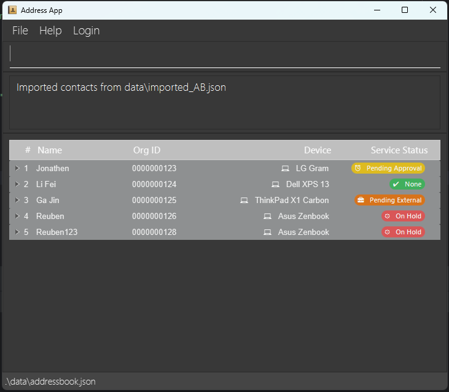

# DeskFlow User Guide

DeskFlow is a powerful desktop application built for IT helpdesk staff to streamline the management of contact
information of organization members, track device information, and keep track of service events. For the tech-savvy,
DeskFlow is optimized for use via a Command Line Interface (CLI), while also featuring a
well-designed, easy to use Graphical User Interface (GUI), making it easy to use for anyone.

## Table of Contents

- [Quick start](#quick-start)
    - [Installation](#installation)
    - [Usage](#usage)
- [Features](#features)
    - [Viewing help](#viewing-help--help)
    - [Adding a person](#adding-a-person-add)
    - [Logging in](#logging-in-login)
    - [Role-based access control](#role-based-access-control)
    - [Listing all contacts](#listing-all-contacts--list)
    - [Editing a person](#editing-a-person--edit)
    - [Set a contacts status](#set-a-contacts-status-set_status)
    - [Filter existing status](#filter-existing-status-filter_status)
    - [Locating contacts by name](#locating-contacts-by-name-find)
    - [Locating contacts by any attribute](#locating-contacts-by-any-attribute-findby)
    - [Deleting a person](#deleting-a-person--delete)
    - [Clearing all entries](#clearing-all-entries--clear)
    - [Exiting the program](#exiting-the-program--exit)
    - [Importing data](#importing-data-import)
    - [Saving the data](#saving-the-data)
    - [Editing the data file](#editing-the-data-file)
    - [Archiving data files](#archiving-data-files-coming-in-v20)
- [FAQ](#faq)
- [Known issues](#known-issues)
- [Command summary](#command-summary)

## Quick start

### Installation

> **Tip**
>
> For experienced users, the latest release of DeskFlow is available as a `.jar`
> file  [here](https://github.cob/AY2425S2-CS2103T-T10-2/tp/releases),
> or you may wish to build the project from [source](https://github.com/AY2425S2-CS2103T-T10-2/tp). Ensure you have
> Java `17` installed.

#### Step 1. Install Java `17` or Above

##### Windows / Linux

Most Windows and Linux distributions come with Java pre-installed. To verify if you have a compatible version of Java,
open a Command Prompt on Windows, or a terminal
on Linux, and run the command `java -version`. You should see an output similar to either of the following:

```bash
java version "17.0.1" 2021-10-19 LTS
openjdk version "17.0.14" 2025-01-21
```

If you do not have Java installed, or if you have a version lower than `17` you may follow the installation
instructions for Windows [here](https://se-education.org/guides/tutorials/javaInstallationWindows.html), and
Linux [here](https://se-education.org/guides/tutorials/javaInstallationLinux.html).

##### Mac OS

You must follow the instructions  [here](https://se-education.org/guides/tutorials/javaInstallationMac.html) to
install a specific version of the Java Development Kit (JDK).

To verify a successful installation, open a terminal and run the command `java -version`. You should see an output
similar to the following:

```bash
java version "17.0.14.fx-zulu" 2021-10-19 LTS
```

#### 2. Download DeskFlow

DeskFlow is available as a Java ARchive (JAR) file, terminating in `.jar`. Install the JAR file from our latest
release [here](https://github.com/AY2425S2-CS2103T-T10-2/tp/releases).

#### 3. Creating a DeskFlow Home Folder

A home folder is the directory where the DeskFlow application's `.jar`, as well as your data files, will be stored.
We recommend creating a new folder in your home directory called `DeskFlow` for this purpose. Copy the previously
downloaded `DeskFlow.jar` file into this folder.

### Usage

*Ensure that you have followed steps 1-3 from the installation.*

1. Open a command terminal, and run `cd /home/folder` to navigate to the home folder, and run `java -jar DeskFlow.jar`
   command in the terminal to run the application.<br>
   A GUI similar to the below should appear.


Here are some key elements of the UI you should be familiar with:<br>


- **Main Menu:** Here, you can conveniently login, access help if you're stuck, or change the file to which the address
  book is saved.
- **Command Input:** This is where you type commands to interact with the address book.
- **Command Result:** When you enter a command, its result will be displayed in this box.
- **Result Table:** When listing or viewing contacts, they will be presented in a table here, whereby each column is
  associated with a field in the header.
- **Person Card:** A single contact is represented in a person card, which displays all of their relevant information.
  These cards are collapsed by default.
- **Saved File:** The file that this address book is saved to.

2. Type the command in the command box and press Enter to execute it. e.g. typing **`help`** and pressing Enter will
   open the help window.<br>
   Some example commands you can try:

- `login`: A pop-up appears for you to log in to your account.
- `list`: Lists all contacts.
- `add n/John Doe p/98765432 e/johnd@example.com a/311, Clementi Ave 2, #02-25 t/Urgent i/123 d/DeviceInfoXYZ s/pending_approval`:
  Adds a contact named `John Doe` to DeskFlow.
- `delete 3`: Deletes the 3rd contact shown in the current list.
- `set_status 3 s/none`: Sets the status of the 3rd contact to `none`.
- `filter_status s/none`: Filter all contacts that have `none` as a status.
- `clear`: Deletes all contacts.
- `logout`: Logs out of account.
- `exit`: Exits the app.

3. Refer to the [Features](#features) below for details of each command.

## Features

<div markdown="block" class="alert alert-info">

**Notes about reading the command format:**<br>

- Words in `UPPER_CASE` are the parameters to be supplied by the user.<br>
  e.g. in `add n/NAME`, `NAME` is a parameter which can be used as `add n/John Doe`.
- Words in square brackets are optional.<br>
  e.g `n/NAME [t/TAG]` can be used as `n/John Doe t/friend` or as `n/John Doe`.
- Items with `…` after them can be added multiple times including zero times.<br>
  e.g. `[t/TAG]…` can be used as ` ` (i.e. 0 times), `t/friend`, `t/friend t/family` etc.
- Parameters can be in any order.<br>
  e.g. if the command specifies `n/NAME p/PHONE_NUMBER`, `p/PHONE_NUMBER n/NAME` is also acceptable.
- Extraneous parameters for commands that do not take in parameters (such as `help`, `list`, `exit`, `login`, `logout`
  and `clear`) will be ignored.<br>
  e.g. if the command specifies `help 123`, it will be interpreted as `help`.
- If you are using a PDF version of this document, be careful when copying and pasting commands that span multiple lines
  as space characters surrounding line-breaks may be omitted when copied over to the application.

</div>

### Role-based access control:

DeskFlow grants different access rights to certain features based on your account's role.

**Administrator**

- can do batch import/export (`import`)
- can add / remove IT staff
- can add / delete (`add`/`delete`)
- all other features

**IT Staff**

- search (`find`/`findby`)
- filter by status (`filter_status`)
- edit status tags (`set_status`)

### Viewing help : `help`

Shows you a message explaining how to access the help page.

Format: `help`

### Logging in: `login`

Opens a Login Dialog where you are prompted to enter your username and password to log in to gain access to DeskFlow
Features.

Format: `login`


Additional Information:
- Deskflow will not grant access to other features until you are logged in.
- Deskflow is a CLI first application where keyboard inputs are optimised, as such you may hit the `Enter` to log in.


### Adding an employee: `add`

Adds an employee to DeskFlow.

Format: `add n/NAME p/PHONE_NUMBER e/EMAIL a/ADDRESS [t/TAG]… i/ORGID d/DEVICEINFO s/STATUS`

Examples:

- `add n/John Doe p/98765432 e/johnd@example.com a/311, Clementi Ave 2, #02-25 t/Urgent t/SoftwareIssue i/000123 d/DeviceInfoXYZ s/pending_approval`
- `add n/Betsy Crowe t/NetworkIssue e/betsycrowe@example.com a/Newgate Prison p/98752135 d/DeviceInfoABC s/none`

<div markdown="span" class="alert alert-primary">:bulb: **Tip:**
A person can have any number of tags (including 0)
</div>

Additional Information:

- Each employee must have a unique organisation ID
- Every field must be filled up

### Editing an employee's details : `edit`

Edits an existing employee's details in the address book.

Format: `edit INDEX [n/NAME] [p/PHONE] [e/EMAIL] [a/ADDRESS] [t/TAG]… [i/ORGID] [d/DEVICEINFO] [s/STATUS]`

Examples:<br>

- `edit 1 p/91234567 e/johndoe@example.com` edits the phone number and email address of the 1st person to be `91234567`
  and `johndoe@example.com` respectively.
- `edit 2 n/Betsy Crower t/` edits the name of the 2nd person to be `Betsy Crower` and clears all existing tags.

Additional Information:

- Edits the person at the specified INDEX. The index refers to the index number shown in the displayed person list. The
  index must be a positive integer 1, 2, 3, …​
- At least one of the optional fields must be provided.
- Existing values will be updated to the input values.
- When editing tags, the existing tags of the person will be removed i.e adding of tags is not cumulative.
- You can remove all the person’s tags by typing t/ without specifying any tags after it.

### Listing all people : `list`

Shows a list of all employees in the organization recorded in DeskFlow.

Format: `list`

### Set a contact's status: `set_status`

Sets an existing employee's current status to the provided status.

Format: `set_status INDEX s/STATUS`

Examples:

- `set_status 1 s/pending_approval` sets the status for the 1st person in the list shown currently listed
  to `pending_approval`.

Additional Information:

- An employee's status may only be set to one of five options.

    - `none`
    - `pending_approval`
    - `servicing`
    - `pending_external`
    - `on_hold`

### Filter by status: `filter_status`

Format: `filter_status s/STATUS`

Examples:

- `filter_status s/pending_approval` gets all contacts with status of `pending approval`.

Additional Information:

- An employee's status only includes one of five options. Searching with an invalid status will return an error.
- Valid status includes:
    - `none`
    - `pending_approval`
    - `servicing`
    - `pending_external`
    - `on_hold`

### Locating contact by name: `find`

Finds contacts whose names contain any of the given keywords.

Format: `find KEYWORD [MORE_KEYWORDS]`

Examples:

- `find John` returns contacts with name containing `john` like `John Doe`
- `find alex david` returns contacts with name containing `alex` and `david` like `Alex Yeoh`, `David Li`

Additional information:
- `find` is case-insensitive. (i.e. `hans` will match `Hans`)
- The order of the keywords does not matter. (i.e. `Hans Bo` will match `Bo Hans`)
- Only full words will be matched. (i.e. `Han` will not match `Hans`)
- Contacts whose names matching at least one keyword will be returned.
  e.g. `Hans Bo` will return `Hans Gruber`, `Bo Yang`

### Locating contacts by any attribute: `findby`

Finds contacts whose attributes match a set of keywords.

Format: `findby [n/NAME_KEYWORDS] [p/PHONE_KEYWORDS] [e/EMAIL_KEYWORDS] [a/ADDRESS_KEYWORDS] [s/STATUS_KEYWORDS] [t/TAG_KEYWORDS]…`

Examples:

- `find n/alex s/pending_external` returns contacts containing the name `alex` or the status is `pending_external` .
- `findby a/jurong s/pending_approval` finds contacts with an address containing `jurong` or the status
  is `pending_approval`.

Additional information:

- The search is case-insensitive for all attributes, so the addresses `BLK123` will match with `blk123`.
- The order of specifying attributes and corresponding keywords does not matter, so the query `findby n/jon s/none` will
  be equivalent to `findby s/none n/jon`.
- For each attribute, the order of keywords does not matter, meaning that the query `findby n/Jonathen Cheng` will be
  equivalent to `findby n/Cheng Jonathen`.
- If multiple attributes are given, contacts that contain the keyword in any of the corresponding attribute will be
  returned.
- Partial words will be matched. (i.e. `Han` will match `Hans`)
- In a single attribute all keywords will be considered as one. (i.e. `H n` will not match `Hans` or `Han`)
- Special symbols will not be filtered before and after keywords.

### Deleting a person : `delete`

Deletes the specified person from the address book.

Format: `delete INDEX`

Examples:

- `list` followed by `delete 2` deletes the 2nd person in the address book.
- `find Betsy` followed by `delete 1` deletes the 1st person in the results of the `find` command.

Additional information:

- Deletes the person at the specified `INDEX`.
- The index refers to the index number shown in the displayed person list.
- The index **must be a positive integer** 1, 2, 3, …

### Clearing all entries : `clear`

Clears all entries from the address book.

Format: `clear`

### Logging out: `logout`

Logs the user out.

Format: `logout`

### Exiting the program : `exit`

Exits the program.

Format: `exit`

### Importing data: `import`

AddressBook data can be imported from an existing AddressBook JSON file.

Format: `import PATH`

Example:

- `import data/imported_AB.json` **replaces** existing data with the imported JSON.


- You should see a success message after successfully importing.
  

Additional information:

- You can use either relative (`data/imported_AB.json`) or absolute
  path (`C:\Users\keega\Documents\tp\data\import.json`).
- You should use the pathing convention that matches your Operating System for better results.

<div markdown="span" class="alert alert-warning">:exclamation: **Caution:**
Importing a new data file will completely replace the existing address book. Hence, you are recommended to make a backup of the file before importing.
</div>

### Saving data

Your DeskFlow data is saved in the hard disk automatically after any command that changes the data. There is no need for
you to save
manually. You can see where the data is stored at the bottom of the DeskFlow window.

### Editing data file

Your DeskFlow data is saved automatically as a JSON file `[JAR file location]/data/deskFlow.json`. Advanced users are
welcome to update data directly by editing that data file.

<div markdown="span" class="alert alert-warning">:exclamation: **Caution:**
If your changes to the data file makes its format invalid, DeskFlow will discard all data and start with an empty data file at the next run. Hence, it is recommended to make a backup of the file before editing it.<br>
Furthermore, certain edits can cause DeskFlow to behave in unexpected ways (e.g., if a value entered is outside of the acceptable range). Therefore, edit the data file only if you are confident that you can update it correctly.
</div>

## FAQ

**Q**: How do I transfer my data to another computer?<br>
**A**:
You should install DeskFlow on the other computer and overwrite the empty JSON data file with the JSON file of your
previous DeskFlow application.
You can find your previous JSON file in the home folder.

## Known issues

1. **When using multiple screens**, if you move the application to a secondary screen, and later switch to using only
   the primary screen, the GUI will open off-screen. The remedy is to delete the `preferences.json` file created by the
   application before running the application again.
2. **If you minimize the Help Window** and then run the `help` command (or use the `Help` menu, or the keyboard
   shortcut `F1`) again, the original Help Window will remain minimized, and no new Help Window will appear. The remedy
   is to manually restore the minimized Help Window.
3. You might not see icons rendering correctly depending on your Operating System. We are working on allowing icons to
   be universally visible.

## Command summary

| Action            | Format, Examples                                                                                                                                                                                                                                   |
|-------------------|----------------------------------------------------------------------------------------------------------------------------------------------------------------------------------------------------------------------------------------------------|
| **Add**           | `add n/NAME p/PHONE_NUMBER e/EMAIL a/ADDRESS i/ORGID d/DEVICEINFO s/STATUS [t/TAG]… `<br/>e.g., `add n/John Doe p/98765432 e/johnd@example.com a/311, Clementi Ave 2, #02-25 i/000123 d/DeviceInfoXYZ s/pending_approval t/Urgent t/SoftwareIssue` |
| **Delete**        | `delete INDEX`<br> e.g., `delete 3`                                                                                                                                                                                                                |
| **Edit**          | `edit INDEX [n/NAME] [p/PHONE_NUMBER] [e/EMAIL] [a/ADDRESS] [t/TAG]… [i/ORGID] [d/DEVICEINFO] [s/STATUS]`<br> e.g.,`edit 2 n/James Lee e/jameslee@example.com`                                                                                     |
| **Find**          | `find KEYWORD [MORE_KEYWORDS]`<br> e.g., `find James Jake`                                                                                                                                                                                         |
| **Find By**       | `findby [n/NAME_KEYWORDS] [p/PHONE_KEYWORDS] [e/EMAIL_KEYWORDS] [a/ADDRESS_KEYWORDS] [s/STATUS_KEYWORDS] [t/TAG_KEYWORDS]…` <br> e.g., `findby n/James Jake s/none`                                                                                |
| **Set Status**    | `set-status INDEX s/STATUS` <br> e.g., `set_status 1 s/none`                                                                                                                                                                                       |
| **Filter Status** | `filter-status s/STATUS`   <br> e.g., `filter_status s/none`                                                                                                                                                                                       |
| **Import**        | `import PATH`         <br> e.g., `import data/imported_AB.json`                                                                                                                                                                                    |
| **List**          | `list`                                                                                                                                                                                                                                             |
| **Help**          | `help`                                                                                                                                                                                                                                             |
| **Login**         | `login`                                                                                                                                                                                                                                            |
| **Logout**        | `logout`                                                                                                                                                                                                                                           |
| **Register**      | `register`                                                                                                                                                                                                                                         |
| **Clear**         | `clear`                                                                                                                                                                                                                                            |

